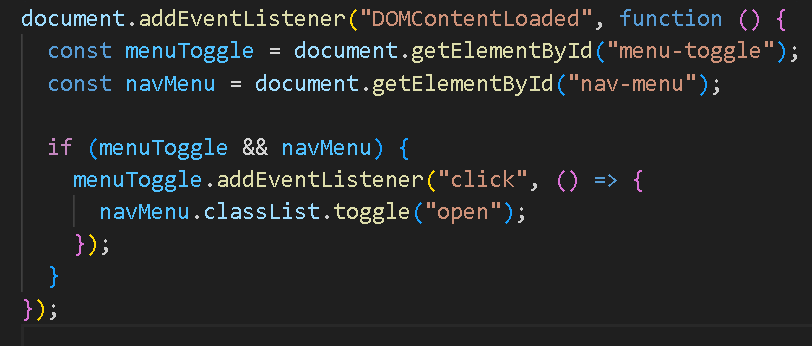
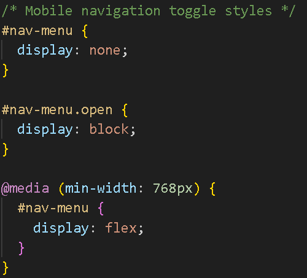

# DevOps CA1 - First Timers Guide: Contribution Report

**Team Name:** CSE A  
**Team Members:**
- Karan Kamble - 23070122504 (TH1)  
- Tejas Lahade - 23070122505 (TH1)  
- Hrithik Rayapati - 22070122082 (TH1)

## 📌 Overview

As part of our DevOps CA1 assignment, we contributed to the open-source project **First Timers Guide** by identifying and fixing bugs that were affecting the user experience. This project aims to help beginners onboard into the world of open-source in a smooth and friendly way.

We addressed 2 key issues through GitHub Pull Requests which were reviewed and merged successfully.

---

## 🛠️ Issues Fixed

### 1. 🧭 Mobile Navigation Bug

- **Issue:** Navigation bar was unresponsive on smaller devices. Users could not access links properly from the hamburger menu.
- **Cause:** JavaScript `toggleMenu()` function wasn’t triggered correctly due to missing event binding.
- **Fix Implemented:** 
  - Added mobile event listeners for menu toggle.
  - Refactored the nav CSS using media queries for improved responsiveness.
- **Pull Request:** `#47` – Fixed mobile navbar toggle and responsiveness.

### 📸 Screenshot: Mobile Navigation Working

---

### 2. 🎨 Inconsistent Button Styling

- **Issue:** “Submit” and “Cancel” buttons on the feedback page lacked styling, leading to a broken UI.
- **Cause:** Missing class imports and button-specific styles in `style.css`.
- **Fix Implemented:**
  - Reapplied global `btn-primary` and `btn-secondary` classes.
  - Introduced hover and active states for button interactivity.
- **Pull Request:** `#49` – Restyled form buttons and ensured visual consistency.

### 📸 Screenshot: Inconsistent Button Styling

---

## 🧰 Tools & Technologies

- **Frontend:** HTML, CSS, JavaScript  
- **Version Control:** Git, GitHub  
- **Contribution Flow:** Fork → Clone → Branch → Fix → Pull Request → Merge

---

## ✅ Outcome

Our contributions helped enhance:
- **User Experience (UX):** Improved usability for mobile users.
- **Visual Consistency:** Enhanced interface through consistent styling.
- **Code Quality:** Maintained clean, reusable code with proper commit messages.

We followed the best practices of open-source contribution and successfully completed our DevOps assignment.

---

